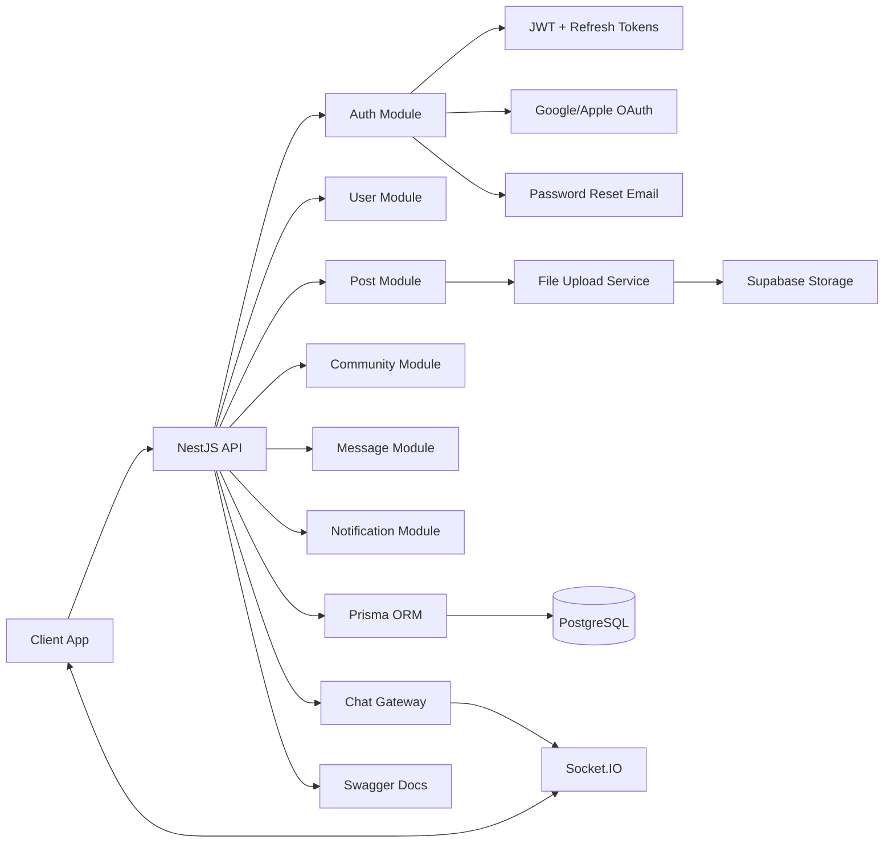

# NestJS Social App API Template

A production-ready NestJS API starter for a social app with auth, posts, communities, chat, notifications, and media upload. It uses Prisma + PostgreSQL, Swagger docs, and Socket.IO for real-time messaging.

## Features
- JWT auth with refresh tokens
- Google and Apple OAuth flows
- Users, posts, comments, likes
- Communities and groups with membership
- Conversations and messages
- Notifications
- Real-time chat via Socket.IO
- Media upload with image, audio, and video compression
- Prisma ORM with PostgreSQL
- Swagger API docs

## Tech Stack
- NestJS 11
- Prisma 6
- PostgreSQL
- Socket.IO
- Supabase Storage (media)
- Swagger / OpenAPI

## Requirements
- Node.js 18+ (20+ recommended)
- PostgreSQL database
- FFmpeg installed for audio and video compression

## Quickstart
1. Install dependencies

```bash
npm install
```

2. Configure environment variables

```bash
cp .env .env.local
```

Update the values in `.env.local` based on the list below.

3. Set up the database

```bash
npx prisma generate
npx prisma migrate dev
npx prisma db seed
```

4. Start the API

```bash
npm run start:dev
```

API runs on `http://localhost:3005` by default.

## Flowchart


## Environment Variables
Create a `.env.local` file (or update `.env`) with these values:

| Variable | Description |
| --- | --- |
| `DATABASE_URL` | PostgreSQL connection string |
| `PORT` | API port, default `3005` |
| `JWT_SECRET` | Access token secret |
| `JWT_EXPIRATION` | Access token TTL, e.g. `1h` |
| `REFRESH_SECRET` | Refresh token secret |
| `REFRESH_SECRET_EXPIRATION` | Refresh token TTL, e.g. `7d` |
| `BASE_URL` | Public base URL for links, defaults to `http://localhost:3000` |
| `GOOGLE_CLIENT_ID` | Google OAuth client ID |
| `GOOGLE_CLIENT_SECRET` | Google OAuth client secret |
| `GOOGLE_CALLBACK_URL` | Google OAuth callback URL |
| `APPLE_CLIENT_ID` | Apple OAuth client ID |
| `APPLE_TEAM_ID` | Apple team ID |
| `APPLE_KEY_ID` | Apple key ID |
| `APPLE_PRIVATE_KEY` | Apple private key string |
| `APPLE_CALLBACK_URL` | Apple OAuth callback URL |
| `SMTP_HOST` | SMTP host for password reset emails |
| `SMTP_PORT` | SMTP port |
| `SMTP_USER` | SMTP username |
| `SMTP_PASS` | SMTP password |
| `SMTP_FROM_EMAIL` | From address for reset emails |

Note: Supabase Storage is used for media uploads. For production, move the Supabase URL and service key out of `src/supabase.service.ts` into environment variables.

## API Docs
Swagger UI is available at:
- `http://localhost:3005/api`

## WebSocket Events
Socket.IO gateway listens for:
- `join_room` to join a conversation room
- `send_message` to emit messages to a room

## Scripts
- `npm run start:dev` Start in watch mode
- `npm run build` Build the app
- `npm run start:prod` Run the built app
- `npm run lint` Lint and fix
- `npm run test` Run unit tests
- `npm run test:e2e` Run e2e tests

## Project Structure
- `src/auth` Auth flows, JWT, OAuth, password reset
- `src/user` User profile APIs
- `src/post` Posts and media
- `src/comment` Comments
- `src/like` Likes
- `src/community` Communities and membership
- `src/group` Groups and membership
- `src/conversation` Conversations and participants
- `src/message` Messages
- `src/notification` Notifications
- `src/chat` WebSocket gateway
- `src/file-upload` Media compression and Supabase storage
- `prisma/schema.prisma` Database schema

## License
UNLICENSED
